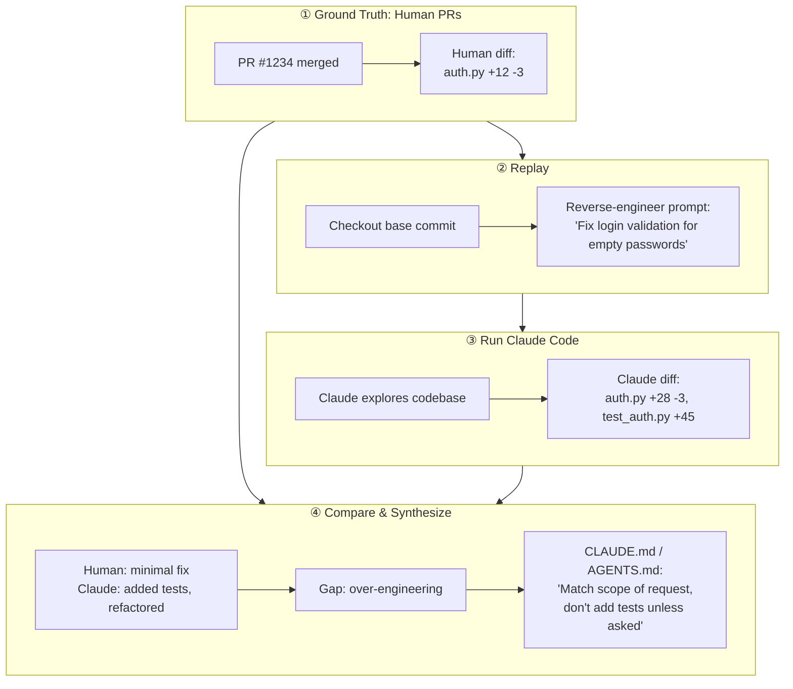

# Agent PR Replay

**Discover how AI coding agents actually navigate your codebase, and where they diverge from human developers.**

The best way to improve an agent's ability to work in a codebase is to observe its default behavior, measure the gap against real human solutions, and steer it based on evidence.

Agent PR Replay takes merged PRs from any repository, reverse-engineers the task prompt, runs Claude Code against it, and compares what the agent did versus what humans actually shipped. The result is targeted, empirical guidance.

**[See example reports →](examples/)**

## How It Works



1. **Ground Truth**: Start with real merged PRs as human-validated solutions
2. **Replay Setup**: Checkout the repo at the PR's base commit, reverse-engineer a task prompt from the diff
3. **Run Agent**: Execute Claude Code with the prompt (same starting point, same task, different solver)
4. **Compare**: Diff what Claude changed vs what humans shipped; identify systematic gaps
5. **Synthesize**: Generate targeted guidance (CLAUDE.md, AGENTS.md, skills) based on observed behavioral patterns

## Installation

**Prerequisites:**
- Python 3.11+
- [GitHub CLI](https://cli.github.com/) (`gh`), authenticated via `gh auth login`
- [Claude Code CLI](https://docs.anthropic.com/en/docs/claude-code) (`claude`), installed and authenticated

> **Warning**: This tool uses the Claude API and will incur costs (~$4 per `--top-k` value). It runs code in git worktrees. Only use with trusted repositories or within sandboxed environments.

```bash
pipx install git+https://github.com/sshh12/agent-pr-replay.git
```

Or with uv:
```bash
uv tool install git+https://github.com/sshh12/agent-pr-replay.git
```

<details>
<summary>Development setup</summary>

```bash
git clone https://github.com/sshh12/agent-pr-replay.git
cd agent-pr-replay
pip install -e ".[dev]"
pre-commit install
```

</details>

## Usage

### Run Analysis

```bash
# Analyze a GitHub repo (clones to temp directory)
agent-pr-replay run https://github.com/pallets/click --days 30 --top-k 5

# Analyze a local repo
agent-pr-replay run ./my-local-repo --days 7 --top-k 3

# Focus on specific types of changes
agent-pr-replay run https://github.com/django/django --days 30 --top-k 5 \
  --instructions "Focus on authentication-related changes"

# Preview available PRs without running analysis
agent-pr-replay run https://github.com/pallets/click --days 7 --dry-run
```

### View Statistics

```bash
agent-pr-replay stats output.json
```

### Generate Report

Synthesize findings into a structured report with guidance and skills:

```bash
agent-pr-replay analyze output.json
```

## Output

The primary output is targeted guidance based on observed behavioral gaps:

- **CLAUDE.md** / **AGENTS.md**: Steering rules for Claude Code or any AI coding agent
- **skills.md**: Reusable agent skills with structured YAML frontmatter

Example from analyzing pytorch/pytorch (10 sessions):

```markdown
## Prefer Deletion Over Defensive Programming

- When fixing bugs in cleanup/teardown code, consider whether the cleanup is necessary at all before adding defensive logic
- Never replace buggy cleanup with commented-out stubs (`pass` statements); prefer complete removal if the cleanup serves no purpose
- Before adding try-finally blocks or defensive reference handling, verify the code path is actually executed and necessary

## Minimal Changes to Existing Code

- When fixing boolean conditions: prefer extending the existing condition with OR/AND clauses over restructuring the entire conditional block
- Never introduce intermediate variables for conditions when a direct boolean expression suffices; this increases diff size unnecessarily
- Preserve existing code structure: if the body of a conditional doesn't need changes, don't nest it further or move it

## PyTorch Dynamo Integration Patterns

- When adding new runtime state functions (like `_is_in_optimized_module()`), register them in dynamo's tracing infrastructure: add to `torch/_dynamo/trace_rules.py` MANUAL_FUNCTIONS dict, and to `torch/_dynamo/variables/torch.py` in both `tracing_state_functions()` and `handle_tracing_state_functions()`
- Never add state-checking functions without trace registration; prefer checking all three integration points
```

These are corrections discovered by comparing Claude's output to merged human PRs. The report also includes suggested agent skills with structured YAML frontmatter.

<details>
<summary><strong>CLI Reference</strong></summary>

### `agent-pr-replay run <target>`

Run analysis on a GitHub repository or local git repo.

| Option | Default | Description |
|--------|---------|-------------|
| `<target>` | (required) | GitHub URL (`https://github.com/owner/repo`) or local path |
| `--days` | 30 | Number of days to look back for merged PRs |
| `--top-k` | 5 | Number of representative PRs to analyze |
| `-o, --output` | output.json | Output file for results |
| `--instructions` | - | Custom instructions for PR selection (e.g., "Focus on auth changes") |
| `--model` | sonnet | Model to use for agent and LLM calls |
| `--dry-run` | - | Preview PRs without running analysis |

### `agent-pr-replay stats <input_file>`

Display aggregated statistics from a previous run.

| Option | Default | Description |
|--------|---------|-------------|
| `<input_file>` | (required) | JSON output from a previous `run` command |

Outputs:
- Tool usage breakdown (Read, Glob, Grep, Edit, Bash, etc.)
- Most frequently read/edited files
- Directory access heatmap
- Bash command patterns

### `agent-pr-replay analyze <input_file>`

Generate an LLM-synthesized report from analysis data.

| Option | Default | Description |
|--------|---------|-------------|
| `<input_file>` | (required) | JSON output from a previous `run` command |
| `-o, --output` | `<input_file>-report.md` | Output path for the markdown report |

Generates:
- Deduplicated guidance (CLAUDE.md / AGENTS.md) organized by theme
- Key insights with citations to specific PRs
- Suggested agent skills with structured YAML frontmatter

</details>

<details>
<summary><strong>Show me the prompts!</strong></summary>

All LLM prompts used in this tool:

| Purpose | File |
|---------|------|
| Reverse-engineer task from PR diff | [`agent_runner.py#L58`](https://github.com/sshh12/agent-pr-replay/blob/36d26f6818400a221bab135015e3bc1f670d91fa/src/agent_pr_replay/agent_runner.py#L58) |
| Select representative PRs | [`pr_selector.py#L100`](https://github.com/sshh12/agent-pr-replay/blob/36d26f6818400a221bab135015e3bc1f670d91fa/src/agent_pr_replay/pr_selector.py#L100) |
| Compare Claude vs human diffs | [`diff_comparison.py#L301`](https://github.com/sshh12/agent-pr-replay/blob/36d26f6818400a221bab135015e3bc1f670d91fa/src/agent_pr_replay/diff_comparison.py#L301) |
| Synthesize final report | [`analyzer.py#L13`](https://github.com/sshh12/agent-pr-replay/blob/36d26f6818400a221bab135015e3bc1f670d91fa/src/agent_pr_replay/analyzer.py#L13) |

</details>
